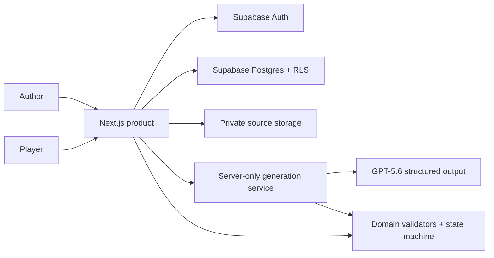
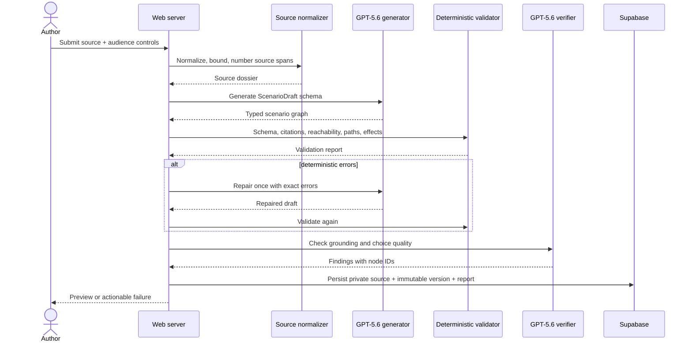
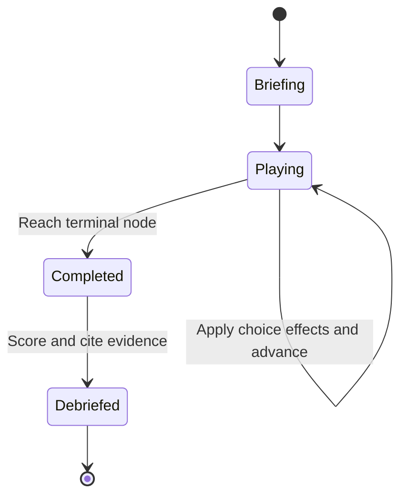

# Architecture

## System context

The browser never calls OpenAI and never receives privileged Supabase credentials. Public players read only published, sanitized trial versions through a narrow server surface.

## Generation sequence

## Runtime state machine

The runtime is deterministic. The same scenario version and choices always produce the same score and terminal state.

## Package responsibilities

| Package | Owns | Must not own |
|---|---|---|
| `domain` | Zod contracts, graph validation, transition reducer, score calculation | React, Supabase, OpenAI |
| `generation` | Prompt construction, structured output adapter, verifier, one repair pass | UI, direct browser use, database policy |
| `web` | Routes, auth boundary, orchestration, persistence adapters | Domain logic duplicated in components |
| `ui` | Accessible presentational components and tokens | Fetching, secrets, business rules |
| `supabase` | Schema, RLS, storage policies, seeds, database tests | Prompt logic |

## Core data model

- `sources`: owner, metadata, normalized text location, processing status.
- `source_spans`: stable numbered excerpts used by citations.
- `trials`: mutable author-owned container and publication state.
- `trial_versions`: immutable scenario JSON, validation report, model metadata, timestamps.
- `runs`: authenticated learner or author play session, selected trial version, status.
- `run_events`: ordered choice IDs and deterministic before/after state.
- `debriefs`: score breakdown and citation references; no hidden chain of thought.

All public-schema tables use RLS. Author-owned rows require `auth.uid() = owner_id`. Published content is read by a server endpoint using a narrowly selected version and then redacted before delivery; anonymous roles have no base-table access. Source objects and verbatim source excerpts remain private and are never reachable through a public trial.

The Next.js proxy refreshes Supabase sessions with the publishable-key SSR client. The generation route first authenticates the author with that RLS-bound client, then uses the server-only `SUPABASE_SECRET_KEY` solely to enforce a generation budget and insert a validated immutable `trial_versions` document. No browser role has insert, update, or delete privileges for a version.

## Failure design

- Oversized or unsupported source: reject before model use.
- Model timeout: retain source and allow retry.
- Invalid structured output: validate and repair once.
- Bad citations or broken graph after repair: save failed report, do not publish.
- Supabase unavailable: sample trial remains playable from a bundled fixture.
- OpenAI unavailable: existing and sample trials remain playable.
- A failed generation retains its private source with a failure reason; it never creates a publishable trial version.

## Security boundaries

- Source text is untrusted data and cannot alter system instructions.
- Scenario text renders as escaped text/Markdown with a strict allowlist.
- No generated HTML, URLs, scripts, SQL, or tool commands execute.
- Secret/service keys exist only in server runtime.
- Storage paths begin with the authenticated owner ID and policies enforce ownership.
- Rate limits and source/model budgets apply at the server boundary.
