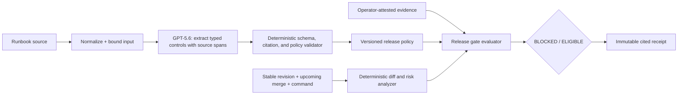

# Runbook Firewall — build plan

## Product decision

Runbook Firewall is a **merge-aware pre-execution release gate**, not a shell runner and not a runbook chatbot. Before an operator performs a risky production change, it compares the stable revision with the upcoming merge, compiles the team's prose runbook into cited, typed safeguards, evaluates the actual change and submitted evidence, then returns an auditable `BLOCKED` or `ELIGIBLE` verdict.

The MVP does not connect to or execute against a production system. It must never claim that a submitted statement is independently verified unless the product has an explicit, testable integration for it. In the first demo, evidence is labelled as operator-attested or demo-verified.

## User, problem, promise

- **User:** an on-call engineer or release owner performing a database migration.
- **Problem:** critical safeguards live in prose runbooks, so a stressful release can skip a backup, approval, maintenance window, or viable rollback.
- **Promise:** "Show the command, show the proof, or the release does not pass."

## Three-minute demo

1. Open a supplied Postgres migration runbook and compare `main` with an upcoming destructive migration merge.
2. Show the generated release gate: maintenance window, change approval, backup, rollback, and affected service; each control cites a runbook excerpt.
3. The unsafe migration is `BLOCKED`: it lacks a backup receipt, approval, and a usable rollback plan. The operator sees the exact missing control and cited reason.
4. Add demo evidence and a validated rollback plan. The deterministic gate becomes `ELIGIBLE`.
5. Open the immutable receipt: command fingerprint, risk signals, evidence status, cited controls, decision, and timestamp.

## Architecture

## MVP domain contract

### Inputs

- One plaintext or Markdown runbook, capped to a safe size.
- A stable revision, upcoming merge revision, changed-file manifest, proposed command, environment, affected service, and optional migration manifest.
- Evidence records for named controls. The initial demo supports operator-attested values only.

### Compiled controls

Every control must have a stable id, an imperative requirement, a type, evidence requirements, severity, and one or more source spans. Initial control types:

- `maintenance_window`
- `approval`
- `backup`
- `rollback_plan`
- `service_impact_acknowledged`

### Deterministic gate

- A control is only satisfied by matching, typed evidence.
- High-risk commands/migration manifests require `backup` and `rollback_plan` even when a generated policy is incomplete.
- Risk signals are explainable heuristics: destructive SQL, schema drops, data rewrite, production target, and missing dry run.
- `ELIGIBLE` requires every blocking control to pass; warnings cannot become a pass.
- The receipt uses canonical JSON plus a SHA-256 fingerprint. It records facts and labels evidence provenance; it is not a cryptographic signature or proof that the release occurred.

## GPT-5.6 boundary

GPT-5.6 is necessary for turning messy, human-authored runbooks into a structured control policy and for proposing repairs when the policy is ambiguous. It never decides a final pass/fail verdict, executes a command, or bypasses a required control.

All model output is Zod-validated, citation-checked, and repaired at most once. The initial demo policy is bundled so the three-minute demo works without a model call.

## Product surfaces

1. **Release desk:** proposed command, risk signal strip, current gate verdict.
2. **Control ledger:** cited safeguards, missing proof, and provenance label.
3. **Proof drawer:** add or inspect typed evidence without implying external verification.
4. **Receipt:** immutable, shareable decision record with redacted private source excerpts by default.

## Data and security

- Extend the current Supabase model with `release_policies`, `release_checks`, `release_receipts`, and owner-scoped evidence records.
- All source documents remain private by default; public receipts expose only an intentionally published policy projection.
- RLS is enabled on every exposed table and access is scoped to `auth.uid()`.
- No OpenAI or Supabase service secret crosses the browser boundary.
- Generated text is rendered as text only; commands are displayed but never executed by the app.

## Scope cuts

Deliberately exclude live infrastructure integrations, real command execution, approval-system OAuth, arbitrary file types, team collaboration, and policy engines for every CI provider. The MVP proves the architecture with one Postgres migration workflow.

## Implementation sequence

1. Replace the branch-level product contract and introduce framework-free release-gate domain types, fixtures, and tests.
2. Build the deterministic analyzer, evaluator, receipt fingerprint, and complete safe/unsafe fixture paths.
3. Rework the web experience into a release desk that makes the blocked-to-eligible transition obvious.
4. Add runbook ingestion and GPT-5.6 structured extraction, verification, and repair behind the domain contract.
5. Persist policies, checks, and receipts in Supabase with migrations and RLS.
6. Deploy a judge-ready demo, test signed-out demo and authenticated author flow, then record the submission video.

## Acceptance gates

- A judge can understand the user, input, and binary value within 20 seconds.
- Both blocked and eligible outcomes are reachable deterministically with provided demo data.
- Every blocked requirement links to a source excerpt.
- No UI labels attested evidence as independently verified.
- Receipt changes whenever a command, policy, or evidence record changes.
- `pnpm lint`, `pnpm typecheck`, `pnpm test`, and `pnpm build` pass.
- The deployed demo works without a model call or a private login.
